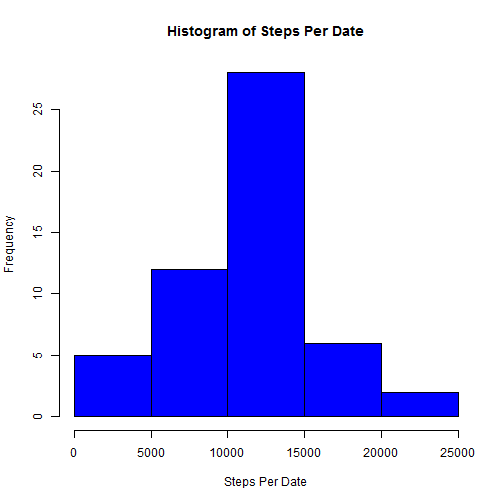
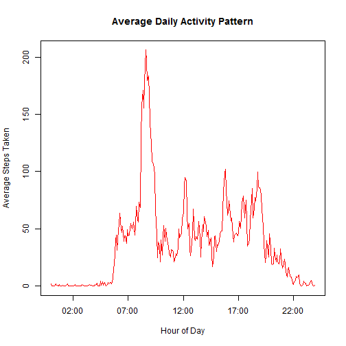
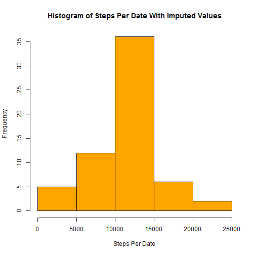
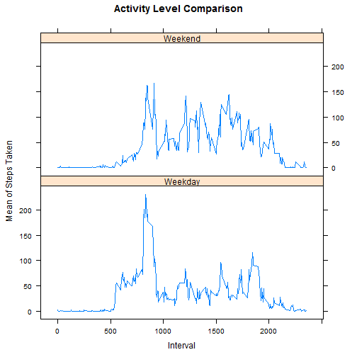

Peer Assessment 1 for Reproducible Research Class
=================================================

Github ID - gr1llman

This is a Rmarkdown file created to satisfy the requirements of the first peer assessed assignment for the Reproducible Research class offered by Johns Hopkins Bloomberg School of Public Health through coursera.org

The assignment includes answering several specific questions about activity monitoring data provided in the instructions. It is important to ensure that the dataset is in the working directory where you will be using this Rmarkdown.

### Loading and preprocessing the data

The first step is to read the data into a data.frame.


```r
activity_data <- read.csv("activity.csv")
```

### What is mean total number of steps taken per day?

This code chunk calculates the total number of steps per date for each date and stores it in a table called "steps_per_date".   By default, the aggregate function ignores NA values.  This code then generates a histogram with various graphic options using the steps_per_date table.  


```r
steps_per_date <- aggregate(steps~date, data=activity_data, sum)
hist(steps_per_date$steps,
     main = "Histogram of Steps Per Date",
     xlab = "Steps Per Date",
     col = "blue")
```

 

The following code calculates the mean and median total steps taken on each date.  These numbers are then displayed in the text statements immediately following this code chunk.

The options statement formats the output so that it is not displayed in scientific notation and so that it is rounded to 2 digits of percision.


```r
options(scipen = 6, digits = 2)
meansteps <- mean(steps_per_date$steps)
mediansteps <- median(steps_per_date$steps)
```


The **mean** number of steps taken each day is **10766.19** steps.  
The **median** number of steps taken each day is **10765** steps.


### What is the average daily activity pattern?

To identify the average daily activity pattern, the first step is to create a data.frame with the mean number of steps taken aggregated by intervals.  Then, to create a true time series, the intervals must be converted to date-time format. 

To do this a vector of 4 digit character strings with added leading zeros for times less than 1000 is created.  This vector is then split into vectors of hours and minutes.  The hours and minutes are pasted together with a colon separator and converted to a real date-time format.


```r
ts1 <- aggregate(steps~interval,data=activity_data, mean)
hhmm <- formatC(ts1$interval, width = 4, format = "d", flag = "0")
hh <- substr(hhmm, 1, 2)
mm <- substr(hhmm, 3, 4)
ctimes <- paste(hh, mm, sep =":")
times <- as.POSIXlt(ctimes, format="%H:%M")
```

The following code depicts the average daily activity pattern using a time series plot.


```r
plot(times, ts1$steps, 
     type="l",
     main = "Average Daily Activity Pattern",
     xlab = "Hour of Day",
     ylab = "Average Steps Taken",
     col = "red")
```

 

The following code calculates the interval with the maximum mean number of steps.  It then takes the row name for that interval, converts it to a number then uses that number to look up the formatted time value for display in the text following the code chunk.


```r
maxs <- ts1[which.max(ts1$steps), ]
max_s_int <- ctimes[as.numeric(row.names(maxs))]
max_s_mean <- maxs$steps
```

The interval with the maximum mean number of steps is **08:35**.  
The maximum mean number of steps during that interval is **206.17**.

### Imputing missing values

The following code chunk calculates the number of rows with NA values in the original data for display in the text immediately following.


```r
na_values <- sum(!complete.cases(activity_data))
```

There are **2304** rows with NA values in this data set.

The following code chunk will replace NA values for number of steps taken with the mean number of steps taken within that same interval across the whole set of data.  It will merge the previously aggregated mean steps by date data.frame with the original data, replace the NA values with the mean for the interval and then clean up the columns and names to match the original data.


```r
impdata <- merge(activity_data, ts1, by.x = "interval", by.y = "interval")
impdata$steps.x[is.na(impdata$steps.x)] <- impdata$steps.y[is.na(impdata$steps.x)]
impdata$steps.y <- NULL
names(impdata) <- c("interval", "steps", "date")
```

This next code chunk aggregates the total number of steps per date for each date in the new data and stores it in a table called "steps_per_date2".  This code then generates a histogram with various graphic options using the steps_per_date2 table which includes imputed values.  


```r
steps_per_date2 <- aggregate(steps~date, data=impdata, sum)
hist(steps_per_date2$steps,
     main = "Histogram of Steps Per Date With Imputed Values",
     xlab = "Steps Per Date",
     col = "orange")
```

 

The following code calculates the mean and median total steps taken on each date including the imputed values.  These numbers are then displayed in the text statements immediately following this code chunk.

The options statement formats the output so that it is not displayed in scientific notation and so that it is rounded to 2 digits of percision.


```r
options(scipen = 6, digits = 2)
meansteps2 <- mean(steps_per_date2$steps)
mediansteps2 <- median(steps_per_date2$steps)
```


The **mean** number of steps taken each day including imputed values is **10766.19** steps.  
The **median** number of steps taken each day including imputed values is **10766.19** steps.  

**There is no difference in the mean number of steps with or without imputed values.**    

**The median number of steps increases by 1.19 when imputed values are included.** 


### Are there differences in activity patterns between weekdays and weekends?

The table with the imputed values is used for this analysis.   The first step is to add a column to that table to identify which dates fall on weekends and which fall on weekdays.

The following code will add the column and aggregate the data for plotting.


```r
dow <- weekdays(as.Date(impdata$date))
dow <- sub("Monday", "Weekday", dow)
dow <- sub("Tuesday", "Weekday", dow)
dow <- sub("Wednesday", "Weekday", dow)
dow <- sub("Thursday", "Weekday", dow)
dow <- sub("Friday", "Weekday", dow)
dow <- sub("Saturday", "Weekend", dow)
dow <- sub("Sunday", "Weekend", dow)
impdata$daytype <- dow
plotdata <- aggregate(steps ~ interval + daytype, data = impdata, mean)
```

The following code generates a panel plot comparing weekend activity to weekday activity.


```r
library(lattice)
xyplot(steps~interval | daytype, data = plotdata,
       type = "l",
       layout = c(1,2),
       main = "Activity Level Comparison",
       xlab = "Interval",
       ylab = "Mean of Steps Taken")
```

 
